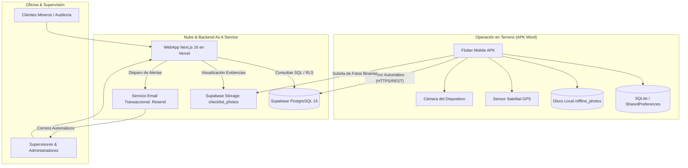

# Documentación Técnica Integral: Sistema Control de Ruta (ScanQR)

**Versión:** 1.1.0  
**Fecha de Publicación:** Septiembre 2026  
**Desarrollo:** RAZE - Diseño Web & Programación (Andrés Alquinta)  
**Plataformas:** WebApp de Gestión (Next.js 16) & Aplicación Móvil Operativa (Flutter Android)  
**Backend:** Supabase BaaS (PostgreSQL + Auth + Storage + Realtime)

---

## 1. Visión General y Arquitectura del Sistema

El sistema **Control de Ruta (ScanQR)** es una solución empresarial de misión crítica diseñada para supervisar, auditar y certificar en tiempo real e in-situ la ejecución de rutas de transporte, rondas de seguridad y control de faenas mineras e industriales.

### Diagrama de Arquitectura

---

## 2. Base de Datos y Modelo de Datos Relacional

El backend utiliza PostgreSQL 15 alojado en Supabase (`wpjzblsqnbfabntwoyke.supabase.co`). Cuenta con 13 tablas relacionales estructuradas para garantizar trazabilidad estricta:

### Tablas Principales

| Tabla | Propósito | Llave Primaria / Claves Foráneas |
|---|---|---|
| `app_users` | Usuarios del sistema (admins, choferes, ayudantes, clientes). | `id` (UUID), `rut` (UNIQUE), `username` |
| `vehicles` | Flota vehicular registrada (camiones, camionetas, furgones). | `id` (UUID), `codigo` (UNIQUE, ej. V-101), `patente` |
| `vehicle_documents` | Documentación obligatoria de cada vehículo (RT, SOAP, Padron). | `id` (UUID), FK: `vehicle_id` |
| `user_documents` | Licencias de conducir, contratos y cédulas de identidad. | `id` (UUID), FK: `user_id` |
| `user_passes` | Pases de ingreso y autorizaciones específicas por faena. | `id` (UUID), FK: `user_id`, FK: `faena_id` |
| `faenas` | Faenas mineras y centros de operación (Centinela, Spence, etc.). | `id` (UUID), `nombre` |
| `faena_points` | Puntos de control GPS de cada ruta y su periodicidad. | `id` (UUID), FK: `faena_id`, `codigo`, `lat`, `lon` |
| `checklist_sections` | Secciones del checklist pre-operacional 360° del vehículo. | `id` (UUID), `titulo`, `orden` |
| `checklist_questions` | Preguntas de inspección vehicular y de puntos de control. | `id` (UUID), FK: `seccion_id`, `tipo_inspeccion` |
| `vehicle_daily_checklists` | Inspección diaria pre-operacional completada por el chofer. | `id` (UUID), FK: `vehicle_id`, FK: `user_id` |
| `route_starts` | Registros de jornada de ruta (inicio, fin, ayudante, GPS). | `id` (UUID), FK: `user_id`, FK: `faena_id`, FK: `ayudante_id` |
| `point_checkins` | Check-in individual de cada punto (fotos, respuestas, GPS). | `id` (UUID), FK: `route_start_id`, FK: `point_id` |
| `app_notifications` | Alertas del sistema (puntos con problema, término anticipado). | `id` (UUID), `tipo`, `leida` |

---

## 3. Especificación Técnica: Aplicación Móvil (APK Flutter)

- **Versión de Producción:** `1.1.0+23`
- **Binario Generado:** `ControlDeRuta-release.apk`
- **SDK Target:** Android 14 (API 34), Min SDK: Android 7.0 (API 24)

### Componentes y Servicios Clave

#### A. Servicio de Sincronización Offline (`lib/services/offline_sync_service.dart`)
- **Almacenamiento Local de Fotos:** Toda fotografía capturada se graba de inmediato en el directorio permanente `/offline_photos` (`getApplicationDocumentsDirectory()`). Nunca se pierden imágenes por cortes de señal.
- **Cola Persistente (`pending_sync_queue`):** Almacena en JSON serializado dentro de `SharedPreferences` los check-ins (`point_checkin`), novedades (`point_problem`), fin de ruta (`route_finish`) y términos anticipados (`route_early_term`).
- **Sincronizador Reactivo:** Monitorea conectividad mediante `hasInternetConnection()`. Al recuperar señal:
  1. Lee la cola en orden FIFO.
  2. Sube los archivos binarios locales a Supabase Storage (`checklist_photos`).
  3. Reemplaza la ruta local por la URL pública definitiva de Supabase.
  4. Inserta/actualiza los registros en la base de datos remota.
  5. Actualiza los contadores en la interfaz (`pendingCountNotifier`).

#### B. Servicio de Ubicación Resiliente (`lib/services/resilient_location_service.dart`)
- **Timeout Automático de 4 Segundos:** En zonas montañosas o subterráneas donde el satélite no engancha, no deja la app congelada.
- **Fallback a Última Posición Conocida:** Consulta el hardware del teléfono para obtener `getLastKnownPosition()`.
- **Inconsistencia Asistida:** Si no hay señal de ningún satélite, permite al conductor registrar el punto marcando automáticamente *"Inconsistencia por falta de señal satelital GPS"*, habilitando la captura de fotos y respuestas del checklist sin bloqueos.

#### C. Control de Reglas de Negocio en Terreno
1. **Regla de No Duplicación Diaria:**
   - Si una ruta ya fue completada exitosamente el día de hoy, la app bloquea iniciarla nuevamente e informa al conductor.
   - Si una ruta quedó parcialmente completada (por término anticipado o cambio de turno), otro chofer o el mismo chofer puede retomarla; los puntos completados aparecen bloqueados en verde con su hora exacta y solo permite ejecutar los pendientes.
2. **Geocerca de Punto (200 Metros):**
   - El operador debe encontrarse a menos de 200 metros del punto fijado en el mapa para registrar normalmente. Si excede los 200 metros, la app exige confirmación y marca el registro como `inconsistente = true`.

---

## 4. Especificación Técnica: WebApp de Gestión (Next.js 16)

- **Framework:** Next.js 16.3.2 (App Router, Webpack/Turbopack, TypeScript)
- **Estilos:** Tailwind CSS 4 con Glassmorphism y diseño responsivo
- **Iconografía:** Lucide React
- **Georreferenciación:** Leaflet con OpenStreetMap en componentes de carga dinámica (`ssr: false`)
- **Despliegue Continuo:** Vercel conectado a la rama `main` de GitHub

### Módulos Funcionales

1. **Pantalla de Inicio de Sesión y Recuperación de Credenciales:**
   - Autenticación contra tabla `app_users`.
   - Recuperación de contraseña vía correo electrónico con plantilla HTML profesional.
   - Footer institucional con logotipo de **RAZE** y datos de contacto directo de soporte.
2. **Dashboard de KPIs y Estado de Pago:**
   - Algoritmo de cálculo de cumplimiento porcentual basado en la **periodicidad configurada para cada punto**:
     - Puntos diarios: 1 registro por día laboral.
     - Puntos semanales: 1 registro dentro del periodo.
     - Puntos por días específicos (ej. Martes, Jueves, Sábado): calcula la meta esperada exacta en el rango de fechas seleccionado.
   - Deduplicación estricta por `(point_id, fecha)`: evita que reintentos de ruta inflen artificialmente las métricas.
   - Los puntos marcados con problemas/novedades se contabilizan de forma separada ("Con Novedad" en color ámbar) para auditoría transparente con el cliente.
3. **Módulo de Rutas Ejecutadas y Acceso a Evidencias:**
   - Tabla consolidada con filtros por faena, chofer, vehículo, estado y fecha.
   - Modal de detalle con:
     - Resumen general y ayudante asignado.
     - Ubicación GPS de inicio y GPS de término de ruta.
     - Tabla interactiva de puntos de control con modal secundario de evidencias: fecha/hora, estado, coordenadas GPS y fotos de llegada/salida.
4. **Módulo de Vehículos y Choferes (Semáforo Documental):**
   - Alerta visual inmediata (Verde = Al día, Amarillo = Por vencer en menos de 30 días, Rojo = Vencido).
   - El chofer con documentación vencida es bloqueado automáticamente por la APK móvil para evitar multas de inspección del trabajo o de la minera.
5. **Módulo de Faenas y Puntos de Control:**
   - Creación interactiva de faenas con selector de mapa GPS.
   - Configuración de periodicidad de cada punto.
   - Generador e impresor automático de códigos QR listos para plastificar y colocar en terreno.
6. **Centro de Alertas y Notificaciones (Resend API):**
   - Registro en tiempo real de términos anticipados de ruta e inconvenientes en puntos.
   - Envío automático de correos a todos los administradores que tengan activo el interruptor `recibe_notificaciones = true`.
